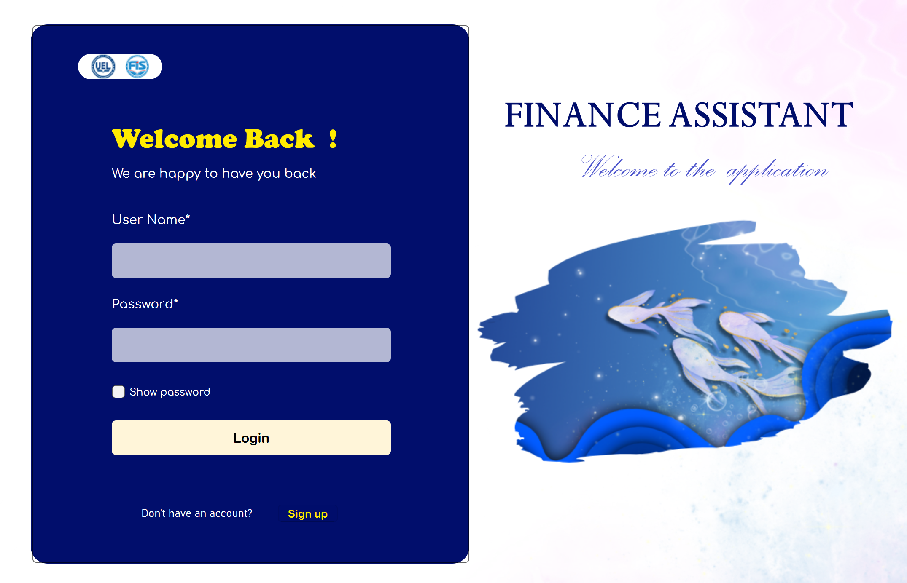

# MVL App

## Giới thiệu
**MVL App** là một ứng dụng quản lý chi tiêu cá nhân được phát triển bằng Python và PyQt6. Ứng dụng giúp người dùng theo dõi chi tiêu, quản lý danh mục và giao dịch tài chính một cách hiệu quả. Dữ liệu được lưu trữ trên **MongoDB**, hỗ trợ thao tác **CRUD** (Create, Read, Update, Delete).

## Tính năng nổi bật
- **Đăng ký & Đăng nhập**: Quản lý tài khoản người dùng an toàn.
- **Thống kê trực quan**: Biểu đồ tổng quan về chi tiêu theo danh mục.
- **Quản lý giao dịch**: Thêm, sửa, xóa các khoản chi tiêu.

## Hướng dẫn sử dụng
### 1. Cài đặt ứng dụng
Chạy lệnh sau để thiết lập môi trường và cấu hình dữ liệu ban đầu:

**python setup.py**

### 2. Khởi động ứng dụng
Sau khi hoàn tất cài đặt, chạy ứng dụng bằng lệnh:

**python MyApp.py**

Giao diện chính sẽ xuất hiện để bạn bắt đầu quản lý chi tiêu của mình.

